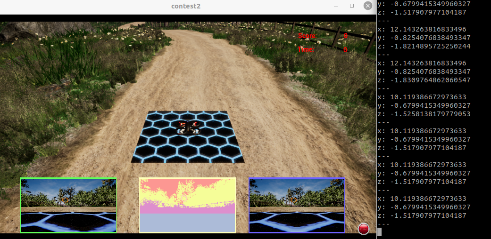
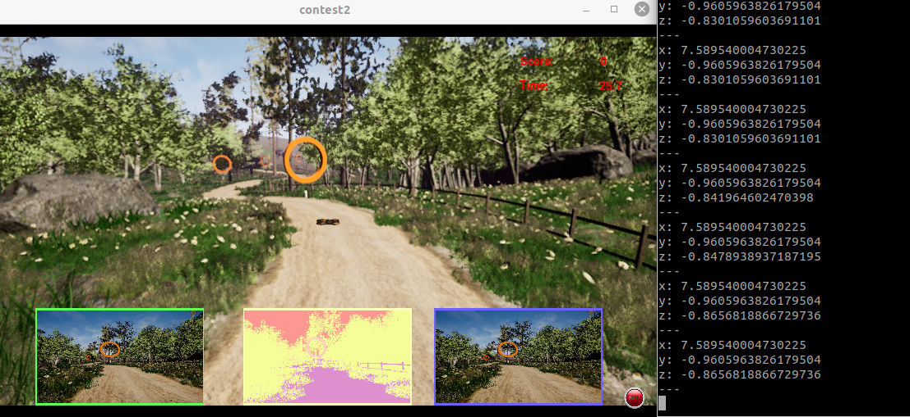
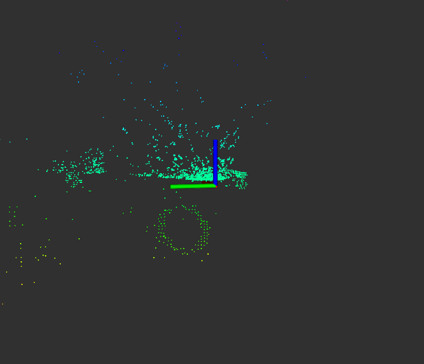
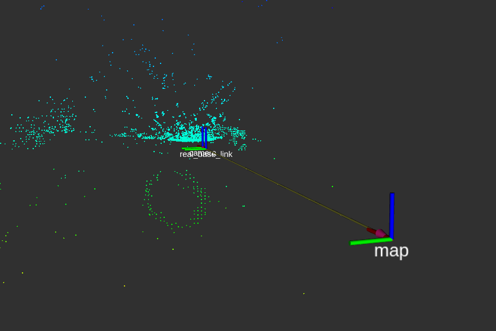
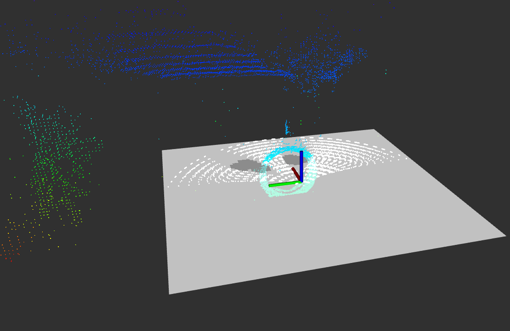

# RoboMaster UAV

The UAV can pass through 7 circles of different colors within 40S, and avoids obstacles such as trees. The average speed is 3m/s, and the highest speed is 7m/s.

```
$ mkdir -p UAV_master_ws/src
$ cd UAV_master_ws/src
$ git clone https://github.com/ZJR0903/RoboMaster_UAV.git
```

---
### Ring Recognition
Identify the orange ring's position and publish the mssage
| Name                   |PUB/SUB| Type            |  Function                         |
| :----------------------|:------:|:------------------:| :----------|
| `/target`              | PUB   | geometry_msgs/Point                | Target     |




---
### 3D Construction
A binocular camera was used for 3D reconstruction
| Name                   |PUB/SUB| Type            |  Function                         |
| :----------------------|:------:|:------------------:| :----------|
| `/scan_point`              | PUB   | sensor_msgs/PointCloud                | Environment     |



---
### TF
Creat TF Tree
| Name               | Function                   |
| :------------------:|:---------------------------:|

|/camera|Camera TF|
|/real_base|UAV TF|
|/base_link|Navigation Reference TF|
|/map|map TF|


---
### Navigation and Control
Using Cubic Spline Curve and PID
